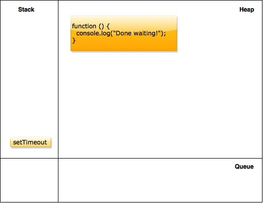

# Visualizing Asynchronous Programs

Asynchronous programming can quickly become complicated. Nested callbacks and
anonymous inline functions can make debugging and reading the call stack
challenging.

## Objectives

By the end of this lesson you should be able to:

- Draw the event loop and related mechanics
- Using language like "stack", "heap", and "queue", identify the order in which
statements will execute given async code (timeout,etc)
- Make multiple nested async calls

## Set The Stage

Understanding JavaScript's asynchronous capability (and how to use it to
your advantage) will allow you to write robust applications for real world
interactions, creating a seamless user experience. Imagine if your
application had to wait for one event to finish before it could start another.
What kind of problems could that lead to? What would the user experience be
like?

The "what" of this exercise is that you'll do a bunch of searching and reading
to first visualize how the event loop runs. Then, you'll practice evaluating
code and creating your own visualizations.

Let's get started.

## Activities

Search around for some good explanations of the event loop.  Here are a few to get you started:

- https://developer.mozilla.org/en-US/docs/Web/JavaScript/EventLoop
- https://www.youtube.com/watch?v=8aGhZQkoFbQ
- http://www.altitudelabs.com/blog/what-is-the-javascript-event-loop/

Here is an excellent tool for visualizing the event loop. Spend some time with
it and put different pieces of code in there to see what happens:

[latentflip.com](http://latentflip.com/loupe/?code=JC5vbignYnV0dG9uJywgJ2NsaWNrJywgZnVuY3Rpb24gb25DbGljaygpIHsKICAgIHNldFRpbWVvdXQoZnVuY3Rpb24gdGltZXIoKSB7CiAgICAgICAgY29uc29sZS5sb2coJ1lvdSBjbGlja2VkIHRoZSBidXR0b24hJyk7ICAgIAogICAgfSwgMjAwMCk7Cn0pOwoKY29uc29sZS5sb2coIkhpISIpOwoKc2V0VGltZW91dChmdW5jdGlvbiB0aW1lb3V0KCkgewogICAgY29uc29sZS5sb2coIkNsaWNrIHRoZSBidXR0b24hIik7Cn0sIDUwMDApOwoKY29uc29sZS5sb2coIldlbGNvbWUgdG8gbG91cGUuIik7!!!PGJ1dHRvbj5DbGljayBtZSE8L2J1dHRvbj4%3D)

Do a google image search and find some of the top results for "javascript event
loop visualization" or "javascript message queue". Find one that makes sense to
you!


## Evaluating

Take the following code:

```js
setTimeout(function () {
  console.log("Done waiting!");
}, 5000)

console.log("I'm waiting");
```

Go ahead and open up a `node` REPL, or a Chrome Snippet and run that code. Is
the result what you expected?

The key here is that javascript empties the stack first, then empties the queue.



So even this code:

```js
var foo = function () {
  setTimeout(function () {
    console.log("Still later...");
  }, 0)

  console.log("Still first");
}

foo()
```

The "Still first" is _guaranteed_ to run first.  Even though we said 0 seconds,
what javascript does is:

1. Puts foo on the stack
1. Puts setTimeout on the stack, which adds an anonymous function to the heap
1. Pops setTimout off the stack, but since `foo` is still on there, keeps
processing
1. Logs "Still first"
1. Is done with `foo`, so pops it off the stack
1. Then immediately looks at the queue, and sees a function is there (the
scheduler dropped it in there for you)
1. Adds that anonymous function to the stack, and runs it

What about this one?

```js
var result = []

var thingOne = function () {
  setTimeout(function () {
    result.push("foo")
  }, 500)
}

var thingTwo = function () {
  setTimeout(function () {
    result.push("bar")
  }, 400)
}

thingOne()
thingTwo()

console.log(result);

// what will get logged??
```

Where does result live and why?

Given the example diagram above, what would the stack/heap/queue progression
look like for the above two programs? Make your own stack/heap/queue diagram for
each one and insert your images below.  (Try [Draw.io](https://www.draw.io/) or any program you
like )

### Your Diagrams Below

1.
1.

## Reflect - Self Assess

Go through the Objectives above. For each one, how do you think you did?

If you didn't do well on some of them, where are you getting stuck? Go back and
review the material (do some more googling, drawing etc) and see if you can get
un-stuck.

## Reflect - New questions

What new questions do you have now that you've seen these examples? Write down 4:

1. _
1. _
1. _
1. _

## TODO: more complex, nested examples
